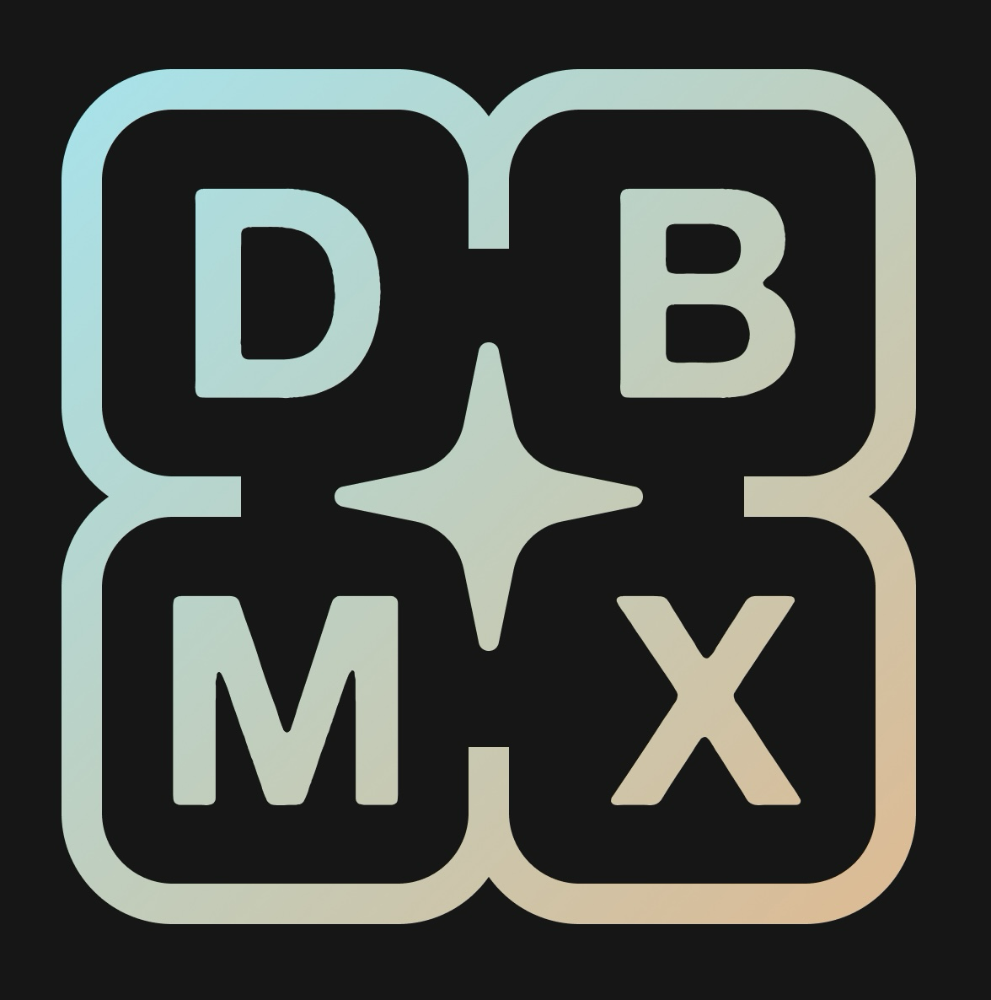

<p align="center">
  
</p>

<h1 align="center">DBMX</h1>

<p align="center">
  <strong>An AI-native database management tool built for speed and simplicity.</strong>
</p>

<p align="center">
  <a href="#features">Features</a> •
  <a href="#screenshots">Screenshots</a> •
  <a href="#tech-stack">Tech Stack</a> •
  <a href="#prerequisites">Prerequisites</a> •
  <a href="#local-development">Local Development</a> •
  <a href="#building">Building</a> •
  <a href="#project-structure">Project Structure</a> •
  <a href="#contributing">Contributing</a> •
  <a href="#license">License</a>
</p>

---

> [!WARNING]
> **dbmx** is under active development and is **not yet ready for production use**. Expect breaking changes.

---

## Features

- **🤖 AI-Native Workflows** — Built from the ground up with AI-assisted database operations in mind, bringing intelligent tooling directly into your workflow.
- **🗄️ Multi-Database Sidebar** — Manage and switch between multiple database connections from a single, organized sidebar. Tag connections with custom colors and environment labels.
- **✏️ Monaco Editor** — Write and execute SQL queries with the same editor that powers VS Code — complete with syntax highlighting, IntelliSense-style autocomplete, and multi-cursor support.
- **🔌 Easy Connection Management** — Add, edit, and organize PostgreSQL connections with support for SSL and SSH tunneling. All credentials are stored locally in an encrypted SQLite database.
- **📊 Table View** — Browse query results in a rich, sortable data table powered by TanStack Table. Filter, paginate, and inspect your data without leaving the app.
- **🗂️ Tabs & Sessions** — Work across multiple queries simultaneously with a tabbed interface. Tab state (editor content, active database, query results) is persisted automatically.
- **🔐 Authentication** — Optional Supabase-backed authentication for syncing settings and managing billing.
- **🌙 Dark Mode** — First-class dark mode support with a polished, modern UI.

---

## Screenshots

#### DBMX


#### Multi Database Sidebar


#### Table View


#### Autocomplete Tables and Columns


#### Manage Schema


#### Manage Connections


#### Edit Cells


---

## Tech Stack

| Layer        | Technology                                                             |
| ------------ | ---------------------------------------------------------------------- |
| **Framework** | [Wails v2](https://wails.io/) — Go + Web frontend desktop framework  |
| **Backend**  | Go 1.24, SQLite3 (local state), pgx (PostgreSQL driver)                |
| **Frontend** | SvelteKit 5, TypeScript, Tailwind CSS                                  |
| **UI**       | shadcn-svelte, Flowbite Svelte, Lucide Icons                           |
| **Editor**   | Monaco Editor                                                          |
| **Tables**   | TanStack Table                                                         |
| **Auth**     | Supabase Auth                                                          |
| **DnD**      | dnd-kit (Svelte)                                                       |
| **Package Manager** | pnpm                                                            |

---

## Prerequisites

Before you begin, make sure you have the following installed:

| Tool    | Version   | Install                                                                 |
| ------- | --------- | ----------------------------------------------------------------------- |
| **Go**  | ≥ 1.24    | [golang.org/dl](https://golang.org/dl/)                                 |
| **Node.js** | ≥ 18  | [nodejs.org](https://nodejs.org/)                                       |
| **pnpm** | ≥ 10     | `npm install -g pnpm`                                                   |
| **Wails CLI** | v2   | `go install github.com/wailsapp/wails/v2/cmd/wails@latest`             |

> [!TIP]
> Run `wails doctor` after installing the Wails CLI to verify your environment is correctly set up.

---

## Local Development

### 1. Clone the repository

```bash
git clone https://github.com/your-username/dbmx.git
cd dbmx
```

### 2. Create the environment config

Create the file `config/env/env.toml` with the following content:

```toml
[sqlite3]
name = "app.db"

[supabase]
project_id = "your_supabase_project_id"
anon_key = "your_supabase_public_anon_key"
```

> [!NOTE]
> The `env.toml` file is git-ignored and will not be committed. You **must** create it manually before running the app.

### 3. Start the dev server

```bash
wails dev
```

This will:
- Install frontend dependencies (via `pnpm install`)
- Start the Vite dev server with hot-reload for the frontend
- Compile and run the Go backend
- Open the application window

For **browser-based development**, the Wails dev server is also available at `http://localhost:34115`. You can call Go methods directly from the browser devtools.

---

## Building

To build a production-ready, redistributable package:

```bash
wails build
```

The output binary will be placed in `build/bin/`. On macOS this produces a `.app` bundle; on Windows an `.exe`.

> [!TIP]
> To build a DMG installer on macOS, you can use the generated `.app` bundle with `create-dmg` or a similar tool.

---

## Project Structure

```
dbmx/
├── app/                    # Core Go application logic
│   ├── auth.go             #   Authentication handlers
│   ├── connections.go      #   Database connection management
│   ├── postgres_manager.go #   PostgreSQL connection pooling
│   └── tabs.go             #   Tab state management
├── app.go                  # Wails app lifecycle hooks
├── main.go                 # Application entry point
├── config/
│   ├── database/           # SQLite3 local database setup
│   └── env/                # Environment configuration (env.toml)
├── model/                  # Data models / structs
│   ├── auth.go
│   ├── connections.go
│   └── tabs.go
├── migrations/             # SQL migration files (goose)
│   └── 0001_init.sql
├── frontend/               # SvelteKit frontend
│   ├── src/
│   │   ├── lib/            # Components, stores, Wails bindings
│   │   ├── routes/         # SvelteKit pages
│   │   │   ├── connections/
│   │   │   ├── settings/
│   │   │   ├── billing/
│   │   │   ├── user/
│   │   │   └── llm_manager/
│   │   └── types/          # TypeScript type definitions
│   └── static/             # Static assets
├── build/                  # Build assets & platform configs
│   ├── appicon.png
│   ├── darwin/             # macOS specific build files
│   └── windows/            # Windows specific build files
├── scripts/                # Build helper scripts
├── wails.json              # Wails project configuration
└── go.mod                  # Go module definition
```

---

## Supported Databases

| Database       | Status           |
| -------------- | ---------------- |
| PostgreSQL     | ✅ Supported      |
| MySQL          | 🚧 Planned       |
| SQLite         | 🚧 Planned       |
| MongoDB        | 🚧 Planned       |

---

## Contributing

Contributions are welcome! Here's how to get started:

1. **Fork** the repository
2. **Create** a feature branch: `git checkout -b feature/my-feature`
3. **Commit** your changes: `git commit -m "feat: add my feature"`
4. **Push** to the branch: `git push origin feature/my-feature`
5. **Open** a Pull Request

Please make sure your code follows the existing style and passes all checks before submitting.

---

## License

This project is currently unlicensed. A license will be added in a future release.

---
